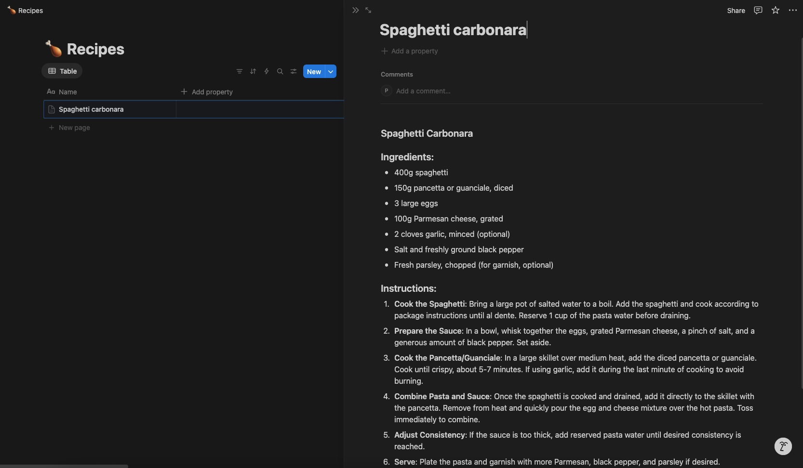
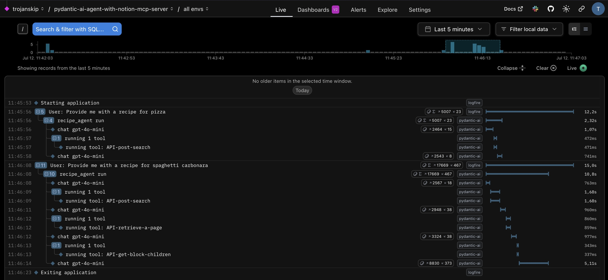

# Pydantic AI Agent with a local Notion MCP Server

This project demonstrates how to build a conversational recipe agent using [Pydantic AI](https://github.com/pydantic/pydantic-ai) and a local
Notion MCP ([Model Context Protocol](https://modelcontextprotocol.io/introduction)) server running in a Docker container.

## Features

- **Conversational AI**: Interact with the agent to find recipes by name.
- **Notion Integration**: Fetches recipes directly from your Notion workspace using a local MCP server.
- **Structured Responses**: Returns ingredients and instructions in clear, readable format.
- **Graceful Handling**: Informs you if a recipe is not found.

## Prerequisites

- `python` version `3.11` or higher
- `uv` version `0.7.19` (for package management)
- Docker (for running the Notion MCP server locally)
- Notion account with access to the recipes database

## Example output

Assuming your recipe database looks like this:



This is an example output when you run the agent:
```plaintext
========================================
      Pydantic AI Recipe Agent
========================================

Welcome to the Pydantic AI Recipe Agent!
You can ask for recipes and I will retrieve them from Notion.
Type 'exit', 'quit', 'stop', or 'end' to terminate the conversation.

What would you like to cook today?

> pizza
Recipe not found in Notion.

> spaghetti carbonara
- Title: Spaghetti carbonara
- Ingredients:
  - 400g spaghetti
  - 150g pancetta or guanciale, diced
  - 3 large eggs
  - 100g Parmesan cheese, grated
  - 2 cloves garlic, minced (optional)
  - Salt and freshly ground black pepper
  - Fresh parsley, chopped (for garnish, optional)
- Instructions:
  1. **Cook the Spaghetti**: Bring a large pot of salted water to a boil. Add the spaghetti and cook according to package instructions until al dente. Reserve 1 cup of the pasta water before draining.
  2. **Prepare the Sauce**: In a bowl, whisk together the eggs, grated Parmesan cheese, a pinch of salt, and a generous amount of black pepper. Set aside.
  3. **Cook the Pancetta/Guanciale**: In a large skillet over medium heat, add the diced pancetta or guanciale. Cook until crispy, about 5-7 minutes. If using garlic, add it during the last minute of cooking to avoid burning.
  4. **Combine Pasta and Sauce**: Once the spaghetti is cooked and drained, add it directly to the skillet with the pancetta. Remove from heat and quickly pour the egg and cheese mixture over the hot pasta. Toss immediately to combine.
  5. **Adjust Consistency**: If the sauce is too thick, add reserved pasta water until desired consistency is reached.
  6. **Serve**: Plate the pasta and garnish with more Parmesan, black pepper, and parsley if desired.
- Link: [Spaghetti carbonara](https://www.notion.so/Spaghetti-carbonara-*********************************)

> exit
Ending conversation. Goodbye!
```

## Installation
1. Clone the repository:
    ```bash
    git clone https://github.com/anybody84/pydantic-ai-agent-with-notion-mcp-server.git
    cd pydantic-ai-agent-with-notion-mcp-server
    ```

2. Install dependencies using `uv`:
    ```bash
    uv sync
    ```

3. Get your Notion API token (`ntn_*****`) from your Notion integration settings.
More details on how to set this up can be found in the [Notion MCP Server documentation](https://github.com/makenotion/notion-mcp-server/blob/main/README.md#1-setting-up-integration-in-notion).

> **Note:** Make sure you granted the integration access to your recipes' database.

4. Get your OpenAI API key (`sk-*****`) from the [OpenAI API keys page](https://platform.openai.com/account/api-keys).

5. Create a `.env` file in the root directory with the following content:
   ```plaintext
   NOTION_TOKEN=your_notion_api_token
   OPENAI_API_KEY=your_openai_api_key

   # Optional: Set the OpenAI model and the temperature you want to use. Default values are as follows:
   # OPENAI_MODEL="gpt-4o-mini"
   # OPENAI_MODEL_TEMPERATURE=0.0

   # Optional: Set the Logfire token if you want to leverage the observability features.
   # LOGFIRE_TOKEN=your_logfire_token
   ```


## Usage

From the root directory of the project, you can run the agent using:

```bash
uv run src/pydantic_ai_agent/main.py
```

## Observability

This project uses [Pydantic Logfire](https://github.com/pydantic/logfire) for observability.
You can enable observability features by setting the `LOGFIRE_TOKEN` in your `.env` file.
This will allow you to track the agent's interactions and performance metrics.
This is optional, but highly recommended.

Once enabled, you can view the logs and metrics in the Logfire dashboard.


